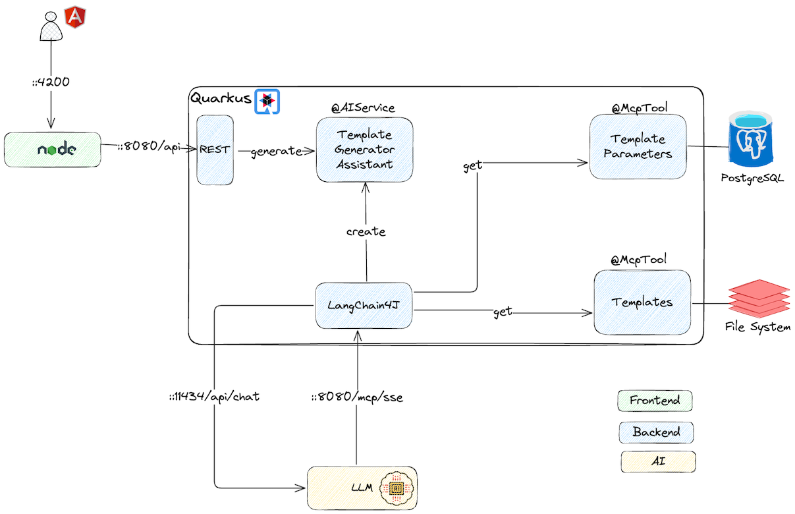

# How I Built an AI-Powered Template Generator with Quarkus, LangChain4j, and Ollama

## Introduction
Businesses have customers, right? And many of them provide online services — shopping, banking, telecom, insurance, and so on.  
But communicating with customers is never easy, especially in the digital era. Which channels are the right ones for a given business? Instant messaging, voice calls, or classic text-based messages?  
What should the tone and style be — formal, friendly, or conversational? And most importantly: **what exactly does the business want to communicate?**

We can agree that most online services rely heavily on **text-based messaging** when communicating with their customers. Sometimes the messages are sent directly via email, other times through a **dedicated in-app messaging system**, where customers have a personal inbox. Typically, these messages are **HTML formatted** — for good reason: better readability, structured layout, support for images and hyperlinks, and a more professional look.

Every business has its own communication style — formal or informal, personal or official — and all customer messages need to follow that same consistent structure and tone. This helps customers easily recognize and understand communications coming from the business.

Now, imagine a company that has **dozens or even hundreds of customer notification types.**  
Take a **Financial Services** example — customers might receive messages like:
- Account opening confirmation
- Loan application received
- Loan approval notification
- Overdue payment notice
- Account statement available
- Security alert (e.g., suspicious activity detected)

Each message type is typically based on a **template**, and each template contains **placeholders** (like `[[customer_id]]`, `[[branch_name]]`, `[[contact_phone]]`, etc.).  
Whenever an event occurs that triggers a notification, the messaging system fills those placeholders with real customer data and sends the message.

So far, so good. But this raises a few questions:
- How can a business ensure that all message types share the same format and style, especially when there are hundreds of templates?
- How many placeholders should exist — and which ones should be used in each template?

Uhh… it’s cumbersome and error-prone. It requires **a lot of manual work** and coordination between teams.

And this is exactly where **AI** can step in — not necessarily to create the customer messages themselves, but to **standardize and accelerate the process of message template generation!**

---
## Use Case
Let’s imagine a **messaging platform for a bank** that communicates with its customers. The standard format is **HTML**, and all message types must follow the same tone, structure, and styling.

Templates contain reusable placeholders such as customer name, ID, branch name, contact details, and so on.  
When a new business case arises — for example, *“A customer wants to request an additional Mastercard”* — an admin just needs to describe the use case in natural language, like:

> “I need a template that describes the process by which a customer can request an additional Mastercard from the bank.”

Optionally, the admin can provide a draft version of the template or simply leave it empty — and the AI takes care of the rest. The AI analyzes existing templates, retrieves placeholder definitions, and generates a **new, well-structured, stylistically consistent HTML message** that fits perfectly with the other templates.

---
## Technology Choices
For this proof of concept, I chose a stack that combines **modern web development** with **AI integration** — and makes experimentation genuinely enjoyable:
- **Angular with PrimeNG** – A perfect fit for building rich, interactive, and scalable single-page applications (SPAs). [PrimeNG](https://primeng.org/) provides a great set of ready-to-use UI components.
- **[LangChain4j](https://docs.langchain4j.dev/)** – An open, composable Java framework that defines a standard interface for LLMs, tools, and data sources. It makes building AI-driven workflows in Java straightforward.
- **[Ollama](https://ollama.com/)** – A local LLM runtime that’s simple to use and well-integrated. For this experiment, I used the `gpt-oss:20b` model, which offered a great balance between performance and quality.
- **[Quarkus](https://quarkus.io/)** – A cloud-native Java framework that integrates seamlessly with LangChain4j. Registering an AI service is annotation-based, and exposing tools is as easy as annotating your code. And honestly — developing with Quarkus is just *fun*.
- **[Quinoa](https://github.com/quarkiverse/quarkus-quinoa)** – A Quarkus extension that simplifies building and serving Angular (or other SPA) applications directly from your backend. It eliminates much of the setup hassle.

---
## Architecture
Angular applications typically run on a Node.js server. However, with **Quarkus’s Quinoa extension**, Quarkus automatically starts the Node.js server when the application runs, seamlessly serving the Angular app. Since Angular operates on the client side, backend communication happens via **REST APIs**. Quarkus automatically generates an [OpenAPI](https://www.openapis.org/) schema, which I used with [Orval](https://orval.dev/) to generate RESTful clients as Angular services (though other tools could be used as well).

For the editor, I chose [Quill](https://quilljs.com/), a free, open-source, WYSIWYG rich text editor with a modular, customizable architecture. PrimeNG conveniently includes an integrated Quill-based editor, which made the frontend implementation straightforward.

Message templates are stored as files (for simplicity), while **template metadata and placeholders** (name, description, etc.) are stored in a **PostgreSQL database**.  
These are made accessible to the AI model via the [Model Context Protocol](https://modelcontextprotocol.io/) (MCP) — a standard that allows language models to call external tools (such as database queries, APIs, or computations) during reasoning.



Here’s how the flow works:

1. The user requests template generation from the frontend.
2. A REST call is made to the registered AI service in Quarkus.
3. The AI service invokes the configured MCP tools to fetch context — existing templates and placeholder definitions.
4. The model analyzes this information and generates or updates the HTML template accordingly.
5. The generated template is returned and rendered in the frontend’s editor.
6. If needed, the user can manually fix invalid tags or fine-tune the content.

The final output always follows the **same structure, style, and placeholder rules** as other templates — ensuring consistency across the entire messaging platform.

---
## Installation
### Prerequisites
- JDK 21 or higher
- Maven 3.5+
- Docker
- [Ollama](https://ollama.com) installed

### Steps
1. Clone the repository:
   ```sh
   git clone https://github.com/fejesa/quarkus-ai-mcp.git
    ```
2. Build the project:
   ```sh
   mvn clean install
   ```
3. Run the application in development mode:
   ```sh
    mvn quarkus:dev
    ```
**Note**: No need to run the PostgreSQL manually — Quarkus Dev mode will automatically start them for you. If the LLM models are not available locally, Quarkus will download them automatically, but this may take some time.

### Usage
Once the application is running, open your browser and navigate to `http://localhost:4200`. You should see the Angular frontend.
Type a description of the template you want to generate, and click the "Generate" button. The AI will create a new HTML template based on your input.

### Configuration
The application can be configured via `application.properties`. The following properties are available:
```properties
quarkus.http.port = 8080

# PostgreSQL database automatically created by Dev Services with the following settings
quarkus.devservices.enabled = true
quarkus.datasource.devservices.port = 5432
quarkus.datasource.devservices.db-name = quarkus
quarkus.datasource.devservices.username = quarkus
quarkus.datasource.devservices.password = quarkus

quarkus.hibernate-orm.schema-management.strategy = drop-and-create
quarkus.hibernate-orm.log.sql = true

# We use HTTP transport for client-server communication in MCP context
quarkus.langchain4j.mcp.template-generator.transport-type = http
# The URL of the SSE endpoint. This only applies to MCP clients using the HTTP transport.
quarkus.langchain4j.mcp.template-generator.url = http://localhost:8080/mcp/sse

# Enable logging of client requests and responses to/from LLM APIs
quarkus.langchain4j.log-requests = true
quarkus.langchain4j.log-responses = true
# If set to true then JSON messages received/sent are logged.
quarkus.mcp.server.traffic-logging.enabled = true
# The number of characters of a text message which will be logged if traffic logging is enabled, default is 200 characters.
quarkus.mcp.server.traffic-logging.text-limit = 10000

# The chat model to use. Set gpt-oss is the default chat model.
quarkus.langchain4j.ollama.chat-model.model-id = gpt-oss
# Global timeout for requests to LLM APIs
quarkus.langchain4j.timeout = 60s
# The temperature to use for the chat model. Temperature is a value between 0 and 1, where lower values make the model more deterministic and higher values make it more creative.
quarkus.langchain4j.temperature = 0.2

# Defines the application path that serves as the base URI for all JAX-RS resource URIs provided by @Path annotations
quarkus.rest.path = /
# The name of the generated OpenAPI file; defaults are openapi.json and openapi.yaml. The schema is automatically generated by Quarkus when the application is started.
quarkus.smallrye-openapi.store-schema-file-name = message-template
# The title of the generated OpenAPI schema document. This title is used in the generated OpenAPI service.
quarkus.smallrye-openapi.info-title = MessageTemplateAPI
# The generated OpenAPI schema documents will be stored here on build. We use this document to generate the Angular client using Oval lib
quarkus.smallrye-openapi.store-schema-directory = src/main/webui/api

# Enable Package Manager Installation. This will override "package-manager" config.
quarkus.quinoa.package-manager-install = true
# The NodeJS Version to install locally to the project. Required when package-manager-install is enabled.
quarkus.quinoa.package-manager-install.node-version = 22.12.0
# The NPM version to install and use. By default, the version is provided by NodeJS.
quarkus.quinoa.package-manager-install.npm-version = 10.9.0

# To enable the UI live-coding dev server, set a start script and set the port in the app config. Quinoa will transparently proxy relevant requests to the given port
quarkus.quinoa.dev-server-port = 4200
# Single Page application routing; when enabled, to allow SPA routing, all relevant requests will be internally re-routed to index.html, this way the javascript can take care of the route inside the web-application.
quarkus.quinoa.enable-spa-routing = true

# Enable the CORS filter. This will allow the Angular client to access the Quarkus API.
quarkus.http.cors.enabled = true
# The allowed origins for CORS requests. This is the URL of the Angular client.
quarkus.http.cors.origins = http://localhost:4200
# HTTP headers allowed for CORS Comma separated list of valid headers. ex: X-Custom,Content-Disposition The filter allows any header if this is not set. default: returns any requested header as valid
quarkus.http.cors.headers = accept, authorization, content-type, x-requested-with
# HTTP methods allowed for CORS.
quarkus.http.cors.methods = POST,GET,PUT,DELETE

# The location of the template files; can be relative or absolute path.
app.templates.location = ./templates
```

### Testing
To run the tests, use the following command:
```sh
mvn clean verify
```
